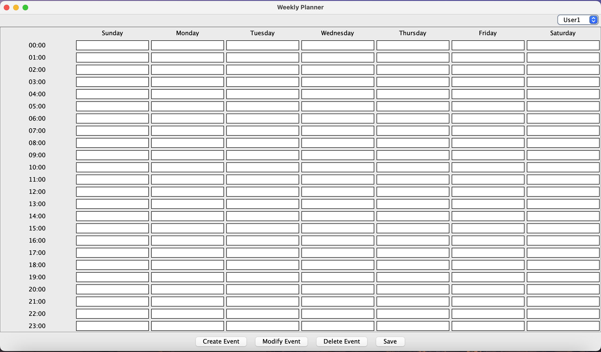

# Weekly-Planner-Using-Java
This is a Simple Weekly Planner Designed using Java.

# Execution steps:
1. Open the Command Prompt or Terminal at the file's Path.
2. javac WeeklyPanner.java
3. java WeeklyPlanner

# General Idea:

# Create Event Steps: